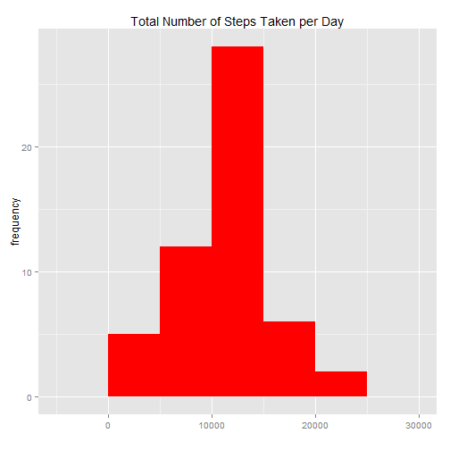
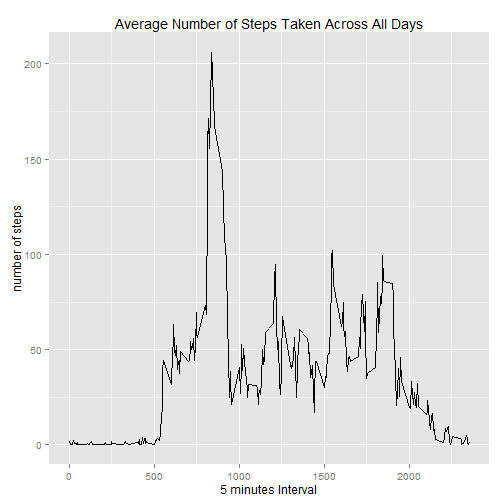
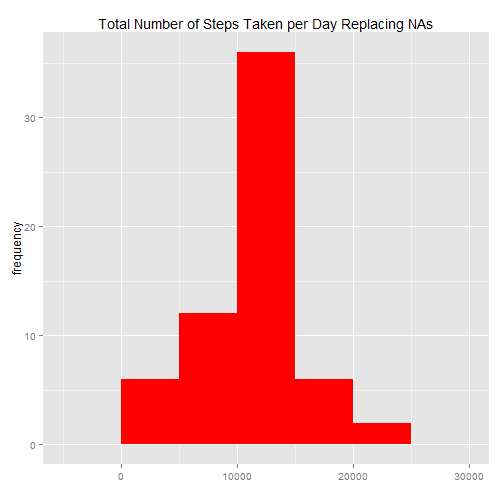
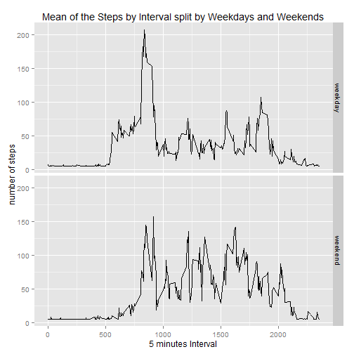

        This assignment makes use of data from a personal activity monitoring device. This device collects data at 5 minute intervals through out the day. The data consists of two months of data from an anonymous individual collected during the months of October and November, 2012 and include the number of steps taken in 5 minute intervals each day

        Data
        The data for this assignment was downloaded from the course web site:
                Dataset: Activity monitoring data [52K]
                         
        The variables included in this dataset are:
    STEPS: Number of steps taking in a 5-minute interval (missing values are coded as NA)
    DATE: The date on which the measurement was taken in YYYY-MM-DD format
    INTERVAL: Identifier for the 5-minute interval in which measurement was taken


####Download the libraries needed for the code


```r
library(dplyr)
library(ggplot2)
```
####Load and preprocess the data
    Loading the data using read.csv() and Process/transform omiting the NAs from the data


```r
# Reading csv file from the directory.
activity <- read.csv("C:/Users/Sergio Simioni/Desktop/Data_Science/activity.csv", sep=";")
head(activity)
```

```
##   steps       date interval
## 1    NA 01/10/2012        0
## 2    NA 01/10/2012        5
## 3    NA 01/10/2012       10
## 4    NA 01/10/2012       15
## 5    NA 01/10/2012       20
## 6    NA 01/10/2012       25
```

```r
dim(activity)
```

```
## [1] 17569     3
```

```r
#Eliminating the NAs values
steps<- na.omit(activity)
```

####What is mean total number of steps taken per day?

        For this part of the assignment, you can ignore the missing values in the dataset.
        1- Calculate the total number of steps taken per day
        2- Calculate and report the mean and median of the total number of steps taken per day


```r
#Calculate the total number of steps taken per day
steps_per_day<- aggregate( steps$steps, by=list(steps$date), FUN = sum)
g<- ggplot(steps_per_day, aes(x))+labs(title="Total Number of Steps Taken per Day")+
  xlab("") + ylab("frequency")
p<- g + geom_histogram(binwidth=5000,fill="red") 
print(p)
```

 

```r
#calculate the mean and the median of the total number of steps taken per day.
print(mean(steps_per_day$x))
```

```
## [1] 10766.19
```

```r
print(median(steps_per_day$x))
```

```
## [1] 10765
```


####What is the average daily activity pattern?

        1- Make a time series plot (i.e. type = "l") of the 5-minute interval (x-axis) and the average number of steps taken, averaged across all days (y-axis)
        2- Which 5-minute interval, on average across all the days in the dataset, contains the maximum number of steps?


```r
#Calculate the average activity pattern
steps_by_interval<- aggregate( steps$steps, by=list(steps$interval), FUN = mean)
g<- ggplot(steps_by_interval, aes(Group.1, x))+labs(title="Average Number of Steps Taken Across All Days")+
  xlab("5 minutes Interval") + ylab("number of steps")
p<- g + geom_line() 
print(p)
```

 

```r
#calculate the 5 minutes interval that contains the maximum number of steps.
max_steps<-filter(steps_by_interval, x == max(x))
print(max_steps[,1])
```

```
## [1] 835
```


####Imputing missing values

        There are a number of days/intervals where there are missing values (coded as NA). The  presence 
    of missing days may introduce bias into some calculations or summaries of the data.

        1- Calculate and report the total number of missing values in the dataset (i.e. the total number of rows with NAs)

        2- Devise a strategy for filling in all of the missing values in the dataset. The strategy does not need to be sophisticated. For example, you could use the mean/median for that day, 
    or the mean for that 5-minute interval, etc.

        3- Create a new dataset that is equal to the original dataset but with the missing data filled in.

        4- Make a histogram of the total number of steps taken each day and Calculate and report 
    the mean and median total number of steps taken per day. Do these values differ from the estimates from the first part of the assignment? What is the impact of imputing missing data on the estimates of the total daily number of steps?


```r
#replacing all NAs by the mean of the steps 
steps_a<- mean(steps$steps )
head(steps_a)
```

```
## [1] 37.3826
```

```r
#loop to replace the NAs
activity_a<- activity
a<- nrow(activity_a)
for ( i in 1:a){
  if (is.na(activity_a[i,1])){
    activity_a[i,1] = steps_a
  }else{
    activity_a[i,1] = activity_a[i,1]
  }
}
head(activity_a)
```

```
##     steps       date interval
## 1 37.3826 01/10/2012        0
## 2 37.3826 01/10/2012        5
## 3 37.3826 01/10/2012       10
## 4 37.3826 01/10/2012       15
## 5 37.3826 01/10/2012       20
## 6 37.3826 01/10/2012       25
```

```r
#Calculate the total number of steps taken per day after replace all NAs by the mean of the steps 
steps_per_day_replacing_NAs<- aggregate( activity_a$steps, by=list(activity_a$date), FUN = sum)
g<- ggplot(steps_per_day_replacing_NAs, aes(x))+labs(title="Total Number of Steps Taken per Day Replacing NAs")+
        xlab("") + ylab("frequency")
p<- g + geom_histogram(binwidth=5000,fill="red") 
print(p)
```

 

```r
#calculate the median and mean and compare the table with and without NAs.
print(mean(steps_per_day_replacing_NAs$x))
```

```
## [1] 10593.13
```

```r
print(median(steps_per_day_replacing_NAs$x))
```

```
## [1] 10766.19
```


####Are there differences in activity patterns between weekdays and weekends?

        For this part the weekdays() function may be of some help here. Use the dataset with the filled-in missing values for this part.

        1- Create a new factor variable in the dataset with two levels-"weekday" and "weekend" indicating whether a given date is a weekday or weekend day.

        2- Make a panel plot containing a time series plot (i.e. type = "l") of the 5-minute interval    (x-axis) and the average number of steps taken, averaged across all weekday days or weekend days (y-axis). See the README file in the GitHub repository to see an example of what this plot should look like using simulated data.


```r
#calculating the difference between weekdays and weekdends
week<- activity_a
week$date<- as.Date(week$date, format="%d/%m/%Y")

week<- mutate(week, weekday = weekdays(date))

weekday <- week[which( week$weekday == "segunda-feira" | week$weekday =="terça-feira"
                       | week$weekday == "quarta-feira" | week$weekday =="quinta-feira"
                       | week$weekday == "sexta-feira"),]

weekend <- week[which( week$weekday == "sábado" | week$weekday =="domingo"),]


#aggregate the average of the steps by interval in weekday
steps_by_interval_weekday<- aggregate( weekday$steps, by=list(weekday$interval), FUN = mean)
steps_by_interval_weekday<- mutate(steps_by_interval_weekday, weekday = "weekday")


#aggregate the average of the steps by interval in weekend
steps_by_interval_weekend<- aggregate( weekend$steps, by=list(weekend$interval), FUN = mean)
steps_by_interval_weekend<- mutate(steps_by_interval_weekend, weekday = "weekend")

# combine the table from weekends and weekdays
general_steps<- rbind (steps_by_interval_weekday,steps_by_interval_weekend)


#plot using ggplot2 the average of the steps by interval in weekday
g<- ggplot(general_steps, aes(Group.1, x))+labs(title="Mean of the Steps by Interval split by Weekdays and Weekends")+
  xlab("5 minutes Interval") + ylab("number of steps")
weekday<- g + geom_line() +facet_grid(weekday~.)
print(weekday)
```

 


###Conclusion

Based on the data of these two months it is possible to see that the person had a good level of activity per day during the period, stablishing an average of 10766 steps per day, which can be considered an elevated number and also during the weekends this  average is higher comparing with the weekdays 


svs/Apr/18/2015


